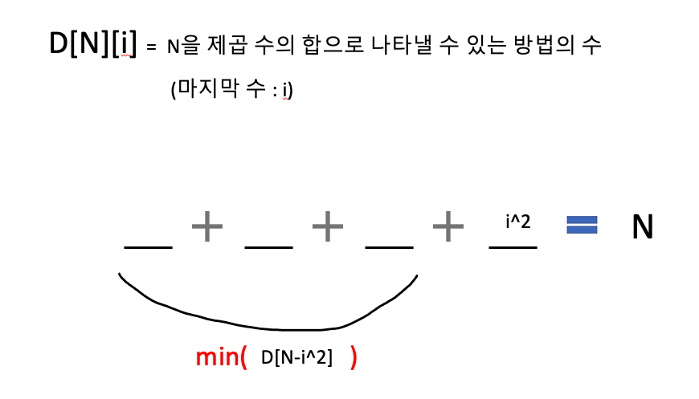

# 개념 메모 2


큰 문제를 작은 문제로 나누어서 푸는 것

- Dynamic Programming : 작은 문제들이 중복이 가능함.
- Divide & Conquer : 작은 문제들이 중복이 가능하지 않음.


# 다이나믹 프로그래밍

### [ 조건 ] 

1. Overlapping Subproblem

   : 작은 문제들이 중복이 된다.

   : 큰 문제와 작은 문제를 같은 방법으로 풀 수 있다.

   : 문제를 작은 문제로 쪼갤 수 있다.

   ex) N번째 피보나치 수 구하기

   

2. Optimal Substructure

   : 문제의 정답이 작은 문제의 정답으로 풀 수 있다.

   : 문제의 크기에 상관없이 어떤 한 문제의 정답은 일정하다.

   

### [ 메모라이제이션 ]

1. 같은 문제는 정답이 같기 때문에, 정답을 저장해둔다.


```c
int memo[100];
int fibonacci(int n){
  if(n<=1){
    return n;
  }else{
    if(memo[n]!=0){
      return memo[n];
    }
    memo[n] = fibonacci(n-1)+fibonacci(n-2);
    return memo[n];
  }
}
```

memo를 추가해서 모든 문제를 1번식만 푼다면, 시간복잡도가 O(2^n) => O(n)

cf) 시간복잡도 : 함수의 호출 횟수(문제의 갯수) * 함수의 시간복잡도(문제 1개 푸는데 필요한 시간)


### [ 구현 ]

1. Top-down 

   : 재귀

   cf) 재귀는 base case + recursive case의 조합으로 구성된다.

2. Bottom-up

   : 반복문 (작은 문제부터 품)


### [ 점화식 ]

: 단계 하나랑 나머지 전체 단계


# 예제

### 백준 11053

<a href="https://www.acmicpc.net/problem/11053">[문제 링크] </a>


##### [느낀점]

풀이와는 별개로 느낀점은 이런 문제를 풀다보면, 혼자서 계속해서 테스트 케이스가 머리속에서 추가된다. 가령,

기존 예시 seqeunce는 다음과 같다.

```
10 20 10 30 20 50
```

이 때,

1. 배열의 첫 원소가 Subsequence의 시작이 아닌 경우

   ```
   (100) 10 20 10 30 20 50
   ```

2. 더 긴 Subseqeucne를 만나는 경우

   ```
   (100) 10 20 10 30 20 50 (11) (12) (13) (14)
   ```

3. 기존 Subsequence의 시작 원소보다 작은 원소를 만난 경우

   ``` 
   (100) 10 20 10 30 20 50 (11) (12) (13) (14) (1) (2) (3) (4) (5) (6) (7)
   ```

4. 작은 원소를 만났지만, 가장 긴 Subsequence는 아닌 경우

   ```
   (100) 10 20 10 30 20 50 (11) (12) (13) (14) (1) (2) (3)
   ```

5. .....

이렇게 테스트 케이스를 발전 시켜나가다보면, 어디서부터 시작해야 할지 막막하기도 하고,

본인이 생각하는 솔루션이 이런 케이스들로 쉽게 무너지는 솔루션이라면 완전 접근을 잘못 했는지 의심이 듭니다.


##### [풀이]

Longest Incresing Subsequence 문제이다.

A 배열의 원소에 대하여 반복문을 돌려서 반복문 현재의 원소가 포함되는 경우, Subsequence의 길이를 새로운 배열에 저장해두면 된다.


### 백준 1699

<a href="https://www.acmicpc.net/problem/1699">[문제링크]</a>


##### [내 생각]

```python
import math

N = int(input())
cnt = 0

while N!=0:
    n = int(math.sqrt(N))
    N -= n*n
    cnt += 1

print(cnt)
```

가장 큰 제곱수를 빼는 방법으로 왜 안 풀릴까?

=> 12의 경우를 생각해보자.

​	12 = 9 + 1 + 1 + 1  (현재 풀이)

​	12 = 4 + 4 + 4         (하지만, 이게 정답)


##### [풀이]

<div>
  
</div>


따라서, D[N]\[i] = min(D[N-i^2]) + 1


